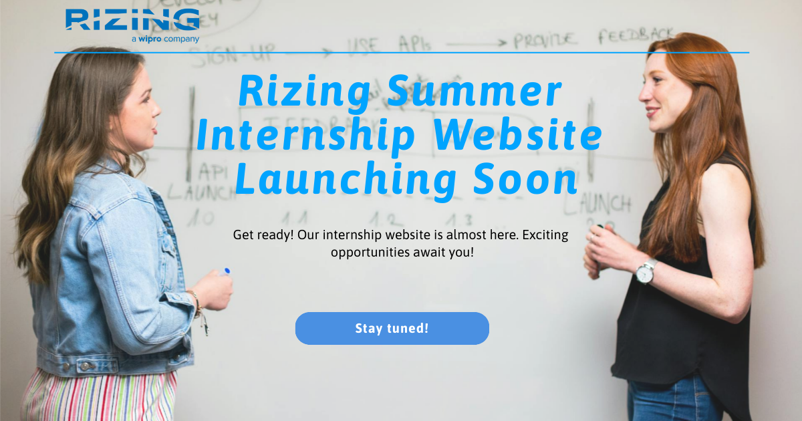

<!-- Top Project Banner -->
<!-- 
 -->
<!--    -->
<!-- 
 -->

<h1 align="center">🚀 Rizing Summer Internship Website</h1>

An enterprise-grade website powered by React, Spring Boot, MongoDB and integrated with Cloudflare and Mailjet.

<!-- 

  
  
  
  
  

 -->

## 📖 Overview

This project is a website built to showcase the experiences of the summer interns at Rizing Consumer Industries. A non-profit program that aims to enhance the skills of upcoming undergraduates to succeed and thrive in the corporate world. This website is meant to showcase their learnings and hardwork throughout the program and inspire others who aim to improve themselves as well.

### ✨ Features

- ⚡ Real-time user interface with React
- 🔒 Robust backend with Spring Boot
- 📦 Scalable NoSQL data layer using MongoDB
- ☁️ CDN and DNS protection via Cloudflare
- 📧 Email integration with Mailjet

## 🛠️ Tech Stack

  
  
  
  
  

## 📬 Contact

  
  <!--  -->
  
  

